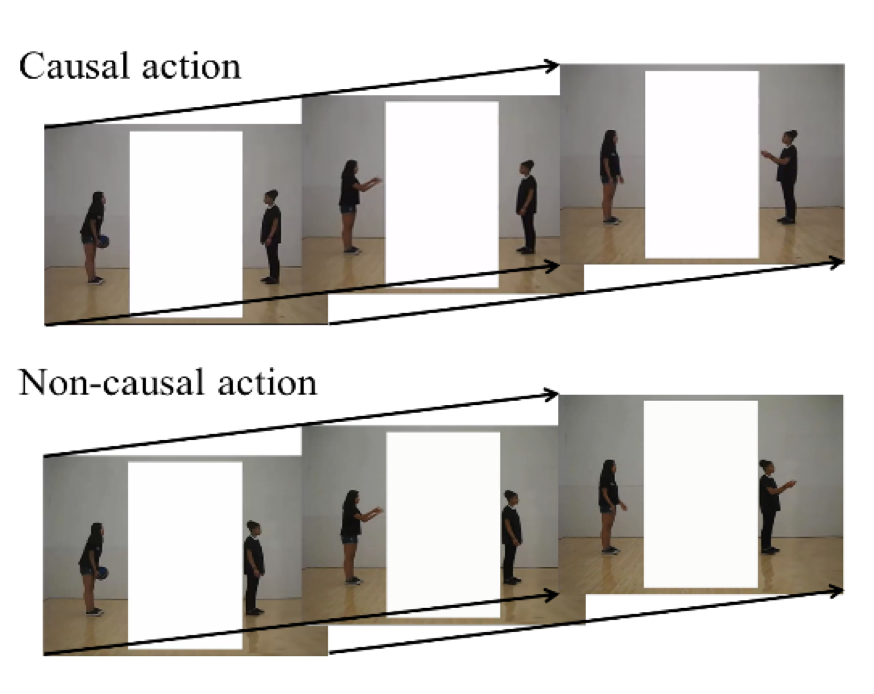

# casual-action-research-assistant

My project was a side project of https://journals.sagepub.com/doi/full/10.1177/0956797617697739 under the supervision of Yujia Peng and Hongjing Lu. 

# background

Research on causality have shown that causality exerts overarching top-down influence on perception. Especially, many research have shown that casuality has a significant effect on motion perception: causal actions are more likely to be perceived as continuous or smooth even when the actions are in fact sudden and abrupt. 

This experiment generates casuality as follows:

If an agent throws a ball to another agent facing the thrower, their actions are causally related. In contrast, if an agent throws a ball to another agent facing away from the thrower, their actions are not causally related. 

Previous experiments by Yujia Peng found that people are more likely to perceive causal actions as smooth actions, even when there is a sudden frame change in receiving actions. Likewise, the present study aims to explore the effect of causality on time perception.

time.m 

analysis.m 

ResearchReport.docx contains detailed explanation and discussion.

## Data

Make sure the matlab files and Result folder are in the same directory to run the program.
The actual result data from the experiment participants remain private. The data in the Result folder are samples meant to be used with the matlab file. 

## Result

## Authors

* **Suhwan Choi** - *Initial work* - [PurpleBooth](https://github.com/PurpleBooth)

See also the list of [contributors](https://github.com/your/project/contributors) who participated in this project.
Joshua Archer
