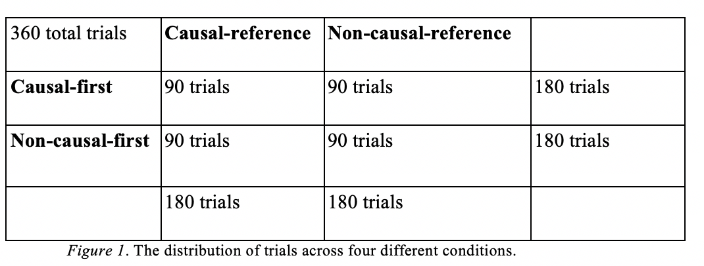

# Hongjing Lu lab Research Project 1

My project was a side project of https://journals.sagepub.com/doi/full/10.1177/0956797617697739 under the supervision of Yujia Peng and Hongjing Lu. 

# Background

Research on causality have shown that causality exerts overarching top-down influence on perception. Especially, many research have shown that casuality has a significant effect on motion perception: causal actions are more likely to be perceived as continuous or smooth even when the actions are in fact sudden and abrupt. 

This experiment generates casuality as follows:

If an agent throws a ball to another agent facing the thrower, their actions are causally related. In contrast, if an agent throws a ball to another agent facing away from the thrower, their actions are not causally related. 

Previous experiments by Yujia Peng found that people are more likely to perceive causal actions as smooth actions, even when there is a sudden frame change in receiving actions. Likewise, the present study aims to explore the effect of causality on time perception.

ResearchReport.docx contains detailed explanation and discussion.

## Data

Make sure the matlab files and Result folder are in the same directory to run the program.
The folder does not contain the actual result data from the experiment because I do not own the right for the data. The data in the Result folder are samples meant for demonstration.

Each participant completed 360 test trials. Each trial showed one causal action video and one non-causal action video, with a short time interval between them. Also, for each trial, one video was chosen as a reference video, which was always 18-frames long. 

Accordingly, three levels were used in video selection: video-order level, video-reference level, and video-length level (see Figure 1). The video-order level had two conditions: causal-first condition (causal videos presented first) and non-causal-first condition (non-causal video presented first). The video-reference level had two conditions: causal-reference condition (causal video is a reference) and non-causal-reference condition (non-causal video is a reference).  

the mat files contain , to name a few. 

## Result

time.m 

analysis.m 

## Authors

* **Suhwan Choi** - *Initial work* - [PurpleBooth](https://github.com/PurpleBooth)

See also the list of [contributors](https://github.com/your/project/contributors) who participated in this project.
Joshua Archer
